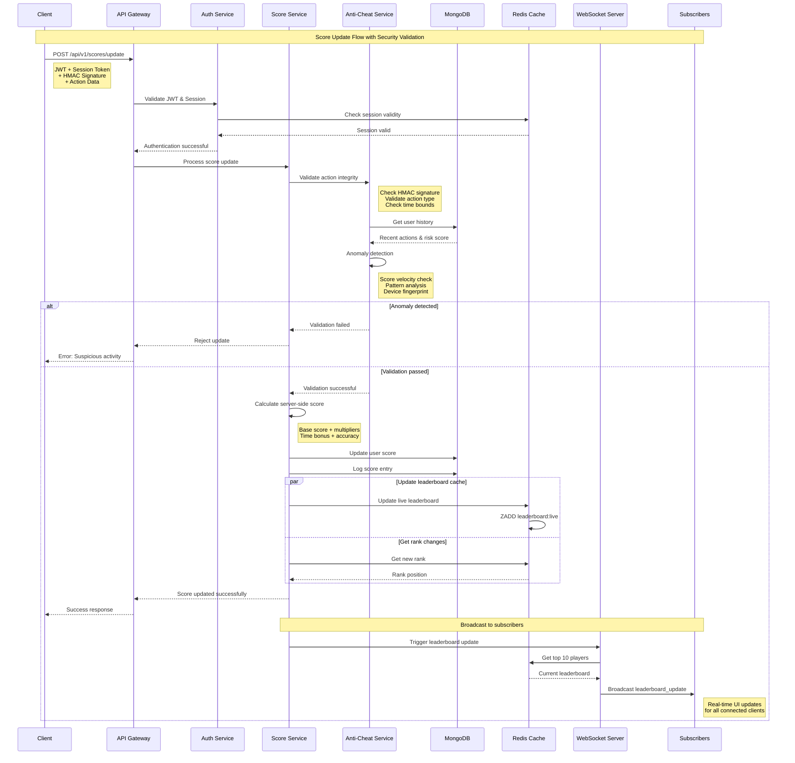
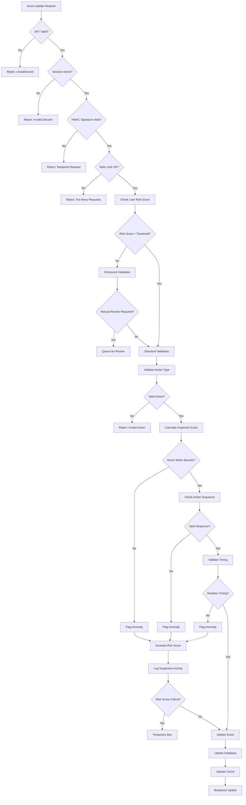
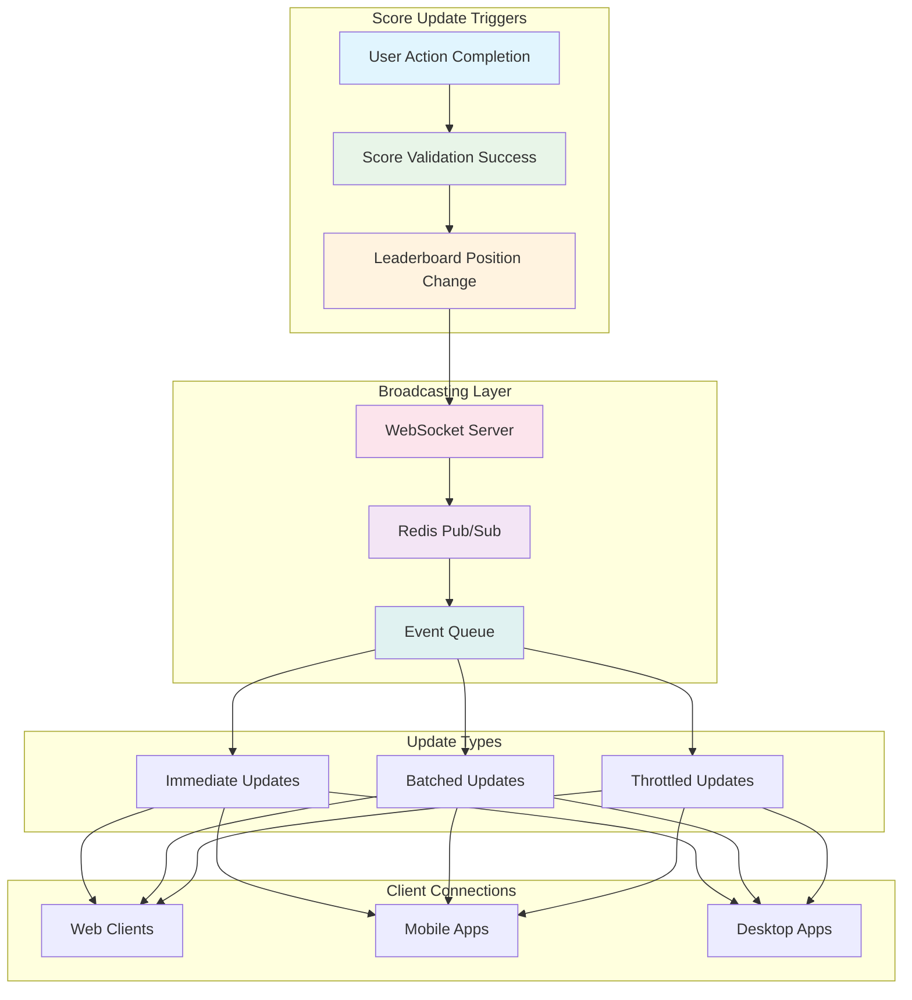
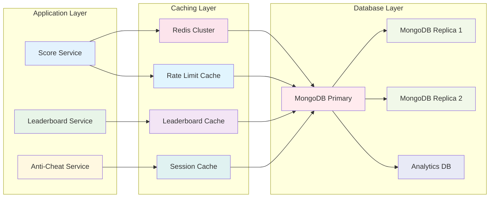
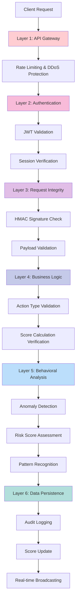

# Execution Flow Diagram

## Complete Score Update Flow

## Anti-Cheat Validation Flow

## Real-time Broadcasting Architecture

## Database and Caching Architecture

## Security Layers Visualization

This comprehensive flow diagram illustrates:

1. **Complete request lifecycle** from client to database and real-time updates
2. **Multi-layered security validation** with specific anti-cheat measures
3. **Real-time broadcasting architecture** for live leaderboard updates
4. **Database and caching strategy** for optimal performance
5. **Security layers** showing the defense-in-depth approach

Each diagram shows the critical decision points, validation steps, and data flow that the engineering team needs to implement for a robust, secure, and performant real-time scoreboard system.
